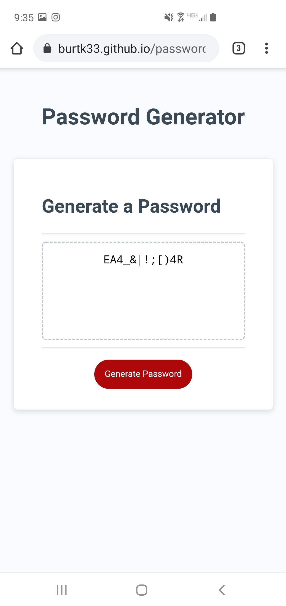

# passwordGenerator

*A password generator that prompts the user for password length and types of characters to use.
*Then generates a random password based on user specified criteria

*Usage: used as a URL in any standard web browser and as a random password generator

https://burtk33.github.io/passwordGenerator/

*Developed by Kyle Burt
